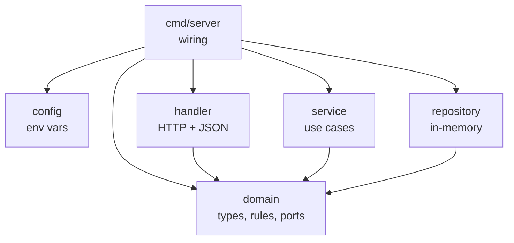

# Architecture Notes

### Hexagonal architecture

This project uses Hexagonal Architecture (Ports & Adapters) to decouple the core business logic from external concerns such as databases, Redis, Kafka, GRPC, etc.
The core defines ports (interfaces), while external components provide the corresponding adapters (implementations). main wires the concrete implementations using dependency injection. 
This makes external implementations replaceable without modifying the core business logic.

### Dependency Inversion 

In order to support Hexagonal Architecture, Dependency Inversion must be respected. The dependency direction points towards the core: the application depends on abstractions, rather than concrete infrastructure implementations. This results in the following dependency graph:

Each arrow is a Go import. Only `main` knows the concrete packages; `handler`, `service` and `repository` know each other only through the interfaces in `domain`.
`domain` imports nothing from `internal/`; at most the standard library or shared packages under `/pkg`.

### Dataflow

At runtime, a HTTP request flows like this:
0. **client** makes a http request to our endpoints
1. **handler** decodes the JSON body, maps it to a domain type and calls `domain.FizzbuzzService`.
2. **service** validates the params, generates the sequence and records the request through `domain.FizzbuzzRepository`.
3. **repository** increments the counter for these params.
4. **handler** maps the result to a response type and writes the JSON envelope.

### Configuration

`config.Load` reads environment variables once in `main`, it uses it and passes relevant configs to the service as a `domain.Limits` value.

### Good approaches

- **Concurrency:** each request runs in its own goroutine; the statistics map, the only shared state, is guarded by a `sync.RWMutex`.
- **Graceful shutdown:** on `SIGINT`/`SIGTERM` the server stops accepting connections and drains in-flight requests for up to 10s.
- **Security:** unknown JSON fields rejected, `limit` and string lengths bounded, internal errors logged but never exposed, non-root container user.
- **Health checks:** `GET /health` is a liveness check; no readiness check, since there are no external dependencies.
- **Docker:** multi-stage build producing a static binary (`CGO_ENABLED=0`) on `alpine`, with module and build caches.

### Scalability

Current implementation is not well adapted for horizontal scalability. Adding replicas of the Fizzbuzz service with Kubernete would make that each pod would hold their own repository InmemoryMap, each one counts only its own traffic. 
Running more than one instance requires a shared store (for example Redis), which plugs in behind the repository interface.

